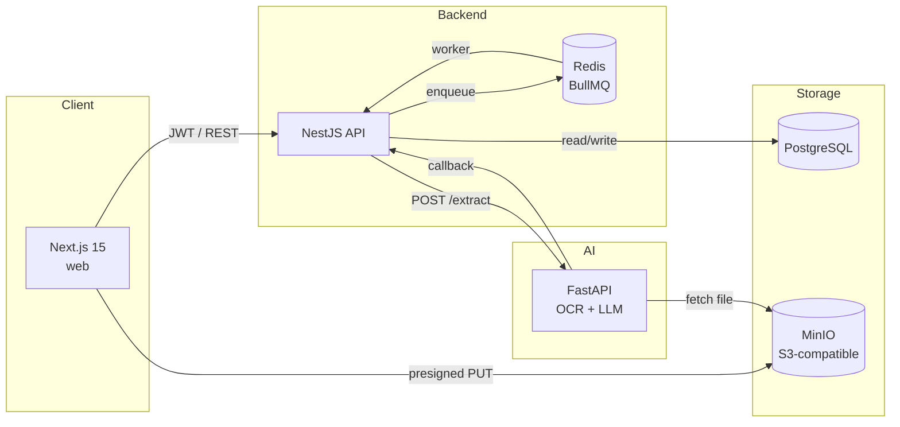

# AgriDoc AI

**AI-powered document management for agrifood & supply-chain operations.**

AgriDoc AI ingests scanned invoices, certificates and lab reports, runs OCR + a large-language-model extraction pipeline, then routes every document through a Human-in-the-Loop review screen where a reviewer can correct, mark fields as N/A, validate, reject or export. The whole pipeline is asynchronous, observable in an audit log, and designed for the regulatory reality of food and agricultural supply chains.

> Final-year project — Internship work, 2026.

---

## Headline features

- **Auto-classification at upload.** The user drops a file; the AI classifies it as `INVOICE` / `CERTIFICATE` / `REPORT` / `UNKNOWN` and reports its confidence — no manual type picker.
- **OCR + LLM-based field extraction.** OpenCV preprocessing → Tesseract OCR → Groq Llama 3.3 70B with type-specific prompts. Confidence is scored per document.
- **Human-in-the-Loop validation.** Every extraction lands in `REVIEW_REQUIRED`. The reviewer fills, corrects or marks each field as N/A with a reason, then validates or rejects.
- **Full audit trail.** Upload, extraction, field updates, validation, rejection and export are all logged with old/new values for compliance.
- **Batch operations.** Validate, reject, delete or export multiple documents in one transaction.
- **PDF export.** Single-document or batch export to a combined PDF with cover page, TOC and per-doc sections.
- **Admin dashboard.** User management, role assignment, deactivation, platform-wide analytics.
- **Dark mode + responsive UI.** Custom design system (deep botanical olive + warm ochre, Fraunces display + Geist body) works from mobile up.

---

## Architecture



The frontend uploads files directly to MinIO via presigned URLs, then notifies the NestJS API. The API enqueues a BullMQ job that calls the FastAPI worker. The worker downloads the file, OCRs it, classifies it, extracts its fields and POSTs the result back to a callback endpoint on the API. The document is then surfaced in the review queue.

For deeper diagrams (sequence flow, ER model, auth flow), see [docs/architecture.md](docs/architecture.md).

---

## Tech stack

| Layer | Tech |
|---|---|
| Web | Next.js 15 (App Router) · React 19 · Tailwind v4 · SWR · react-hook-form · react-pdf · recharts |
| API | NestJS · Prisma · PostgreSQL · BullMQ · Redis · Passport (JWT) · class-validator · Zod · pdfkit · @nestjs/swagger |
| AI | FastAPI · Pydantic · OpenCV · Tesseract OCR · Groq SDK (Llama 3.3 70B) · httpx · boto3 |
| Storage | MinIO (S3-compatible) for documents and avatars |
| Tooling | pnpm workspaces · TypeScript · ESLint |

---

## Repository layout

```
AgridocAi/
├── apps/
│   ├── web/    # Next.js frontend — see apps/web/README.md
│   ├── api/    # NestJS backend  — see apps/api/README.md
│   └── ai/     # FastAPI worker  — see apps/ai/README.md
├── docs/
│   └── architecture.md     # diagrams + ADR-style notes
├── docker-compose.yml      # Postgres, MinIO, Redis
├── COMMANDS.md             # quick-start cheat sheet
└── README.md
```

Each app is a self-contained workspace with its own `package.json` / `pyproject` and its own README.

---

## Prerequisites

- **Node.js** 20+
- **pnpm** 8+
- **Python** 3.12+ (with `tesseract` installed on the host — `brew install tesseract` on macOS, `apt install tesseract-ocr tesseract-ocr-fra` on Ubuntu)
- **Docker** (for Postgres / MinIO / Redis via the compose file)
- A **Groq API key** ([groq.com](https://groq.com)) — free tier is enough for development

---

## Local setup

The repo runs as four processes in parallel (compose-managed infra, the API, the AI worker, the web app). Open four terminals.

```bash
# 1. Infrastructure
docker compose up -d postgres minio redis

# 2. Backend
pnpm install
pnpm --filter api prisma generate
pnpm --filter api prisma migrate deploy
pnpm --filter api dev

# 3. AI worker (Python venv assumed at apps/ai/.venv)
cd apps/ai && python -m venv .venv && . .venv/bin/activate
pip install -r requirements.txt
PYTHONPATH=app uvicorn app.main:app --host 0.0.0.0 --port 8000 --reload

# 4. Web
pnpm --filter web dev
```

The web app is at <http://localhost:3001>, the API at <http://localhost:3000>, Swagger docs at <http://localhost:3000/api>, MinIO console at <http://localhost:9001>.

A friendlier cheat-sheet is in [COMMANDS.md](COMMANDS.md).

---

## Environment variables

Each app reads its own `.env`. The required keys are:

| App | Variable | Purpose |
|---|---|---|
| `apps/api` | `DATABASE_URL` | Postgres connection string |
| `apps/api` | `JWT_SECRET` | Sign + verify JWTs |
| `apps/api` | `AI_SERVICE_URL` | Where the BullMQ worker posts extraction jobs |
| `apps/api` | `AI_CALLBACK_SECRET` | Shared HMAC-style secret stamped on every AI → API callback |
| `apps/api` | `API_BASE_URL` | Used to construct the callback URL sent to the AI |
| `apps/api` | `FRONTEND_URL` | CORS origin |
| `apps/api` | `S3_ENDPOINT` / `S3_REGION` / `S3_ACCESS_KEY` / `S3_SECRET_KEY` / `S3_BUCKET` | MinIO connection |
| `apps/api` | `REDIS_HOST` / `REDIS_PORT` | BullMQ |
| `apps/ai` | `GROQ_API_KEY` | LLM provider |
| `apps/ai` | `AI_CALLBACK_SECRET` | Must match the API value above |
| `apps/ai` | `S3_*` | Same as API, the worker reads files from MinIO directly |
| `apps/web` | `NEXT_PUBLIC_API_URL` | Where the frontend posts to (defaults to `http://localhost:3000`) |

A `.env.example` lives next to each app's `.env`.

---

## What it looks like

Screenshots are in [`docs/screenshots/`](docs/screenshots/). The four headline screens:

- **Dashboard** — KPIs, week-over-week change, four analytics charts.
- **Documents** — paginated table with filters, batch operations, AI confidence chip.
- **Document detail** — split-pane PDF viewer + Human-in-the-Loop review form with the AI's detected type and a per-field N/A workflow.
- **Upload** — multi-file drag-and-drop with classification hint, no type picker.

---

## Authors

- **Aziz Kacem** — final-year internship, 2026
