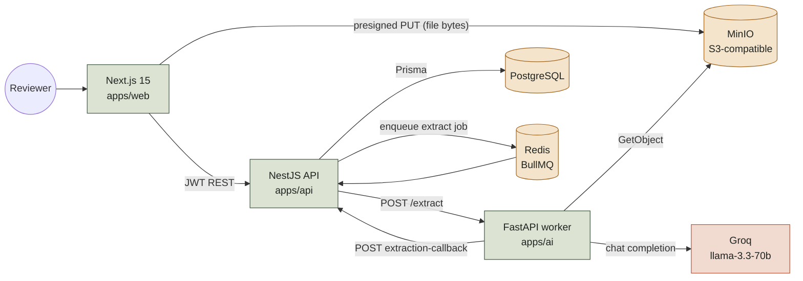
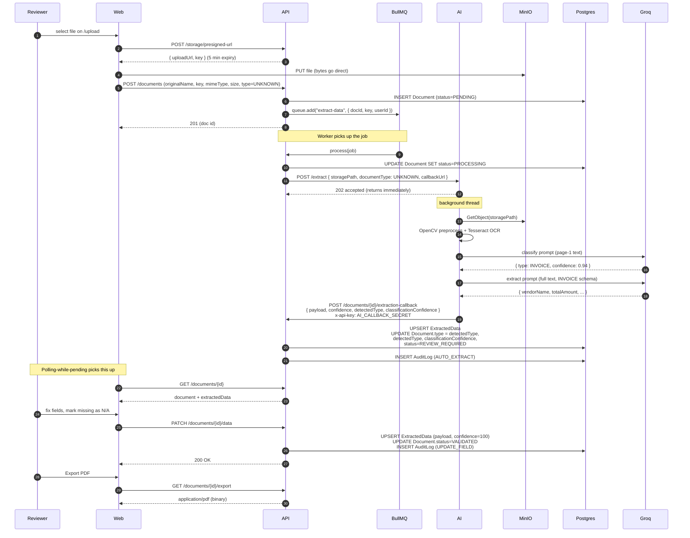
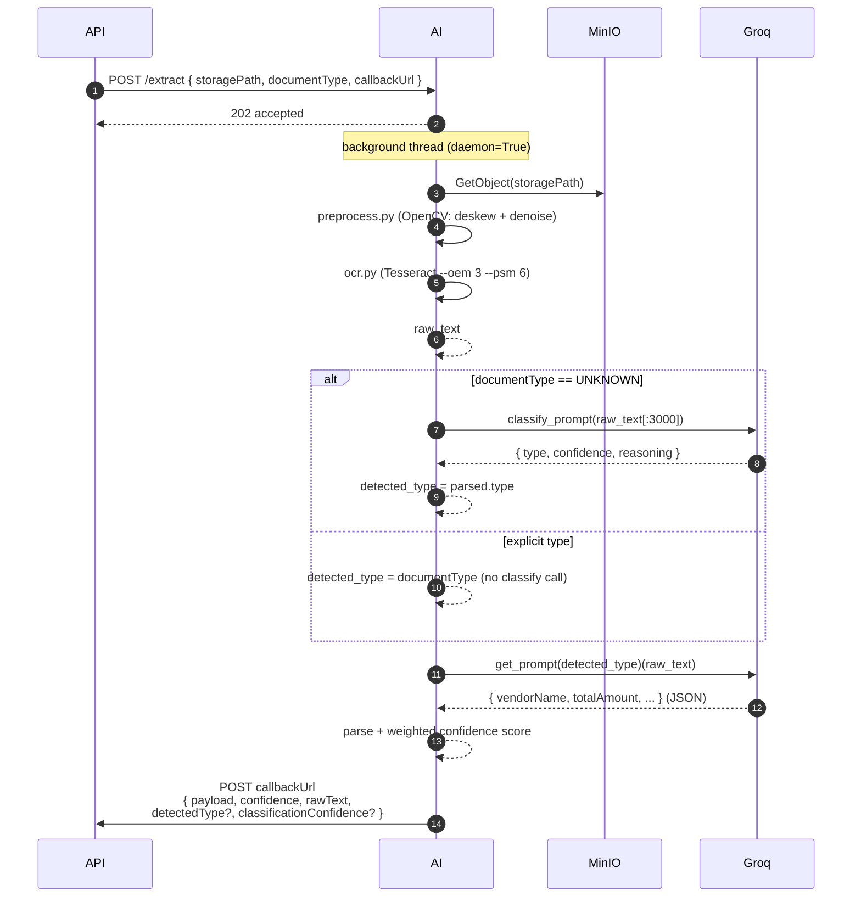
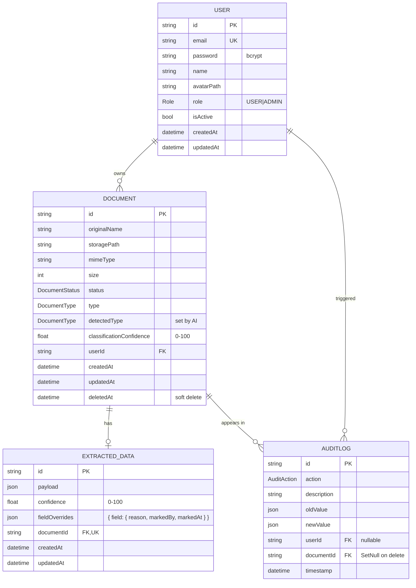
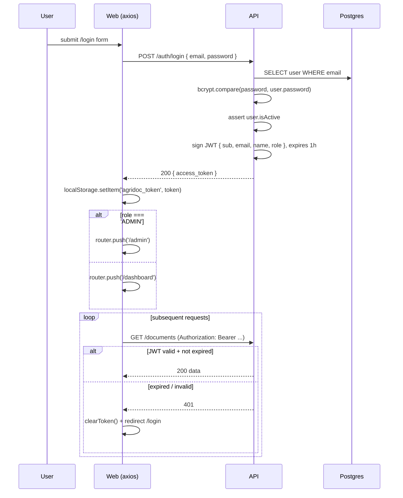

# AgriDoc AI — Architecture

This document is the deep-dive companion to the root README. It covers the system topology, the document-processing sequence, the data model, and the authentication flow. All diagrams are written in Mermaid so they live in version control and render directly on GitHub.

---

## 1. System topology

AgriDoc AI is three apps + three infrastructure components, all running side by side. The web app talks to the API only; it never reaches the AI worker directly. Files travel through MinIO using presigned URLs so the API does not have to proxy bytes.

The Reviewer never sees the AI worker. The API treats it as a fire-and-forget service that calls back when it is done. This decoupling means the AI service can be redeployed, scaled, or replaced without touching the rest of the system, as long as the callback contract holds.

---

## 2. End-to-end sequence — upload to validated

The "golden path" the demo follows: a reviewer drops a PDF, the AI classifies it as `INVOICE`, extracts its fields, and the reviewer validates the result.

### Key contracts shown above

- **Presigned URLs** — short-lived (5 minutes), single-purpose. The API never holds file bytes.
- **`callbackUrl`** — every job carries the URL the AI must POST to when done, including its own `documentId`. The AI never invents URLs.
- **`x-api-key`** — every callback carries `AI_CALLBACK_SECRET`. The API rejects calls without it.
- **`type = UNKNOWN`** — the API uses this as the signal that the AI should classify. Any other value means "trust the caller", which preserves backwards compatibility for future integrations.

---

## 3. AI pipeline detail — classify, then extract

Inside the AI worker the work is split in two stages. Classification looks at page-1 OCR text only and decides the document class. Extraction then uses the type-specific prompt to pull structured fields.

Confidence comes in two flavours, kept separate on purpose:
- **`classificationConfidence`** — how sure the model is about the *type*. Sourced directly from the classifier's JSON output.
- **`confidence`** — how complete the *extraction* is. Computed by `_compute_confidence()` in `apps/ai/app/extraction.py` from a per-field weight table (e.g. on an INVOICE: `vendorName=20, totalAmount=25, ...`).

Both flow back in the callback and are surfaced separately in the UI.

---

## 4. Data model

Four entities, all in PostgreSQL, all owned by Prisma. Soft deletes are enforced everywhere a document is queried.

Notes worth keeping in mind when reading the schema in `apps/api/prisma/schema.prisma`:
- `Document.deletedAt` makes deletes recoverable and keeps the audit trail intact. Every list query filters `deletedAt IS NULL`.
- `AuditLog.documentId` is `SetNull`-on-delete so the log survives even if the document is ever hard-deleted (compliance).
- `ExtractedData.fieldOverrides` carries the per-field N/A workflow: a JSON object keyed by field name, each entry stamped with the reason, the user, and the timestamp.

---

## 5. Authentication & authorization

JWT-based, with two roles. The web app stores the token in `localStorage` and attaches it to every request via an axios interceptor; on a 401 the interceptor clears the token and bounces the user to `/login`.

Endpoint authorization is enforced by `JwtAuthGuard` (default for every controller) plus the `@Public()` decorator for the AI-service callbacks (which are themselves guarded by the `x-api-key` shared secret). Admin-only endpoints additionally use `RolesGuard` + `@Roles(Role.ADMIN)`.

---

## 6. Notable design decisions

- **Why fire-and-forget for the AI worker?** Synchronous calls would tie up Nest workers for the duration of OCR + an LLM round-trip (often 4–8 s on a real PDF). The fire-and-forget + callback model lets BullMQ provide back-pressure and lets the worker be scaled or moved independently.
- **Why does the API tell the AI where to call back?** So the AI worker doesn't have to know the API's hostname statically. It only needs the `callbackUrl` it receives in the job. In Docker this matters: the URL inside the cluster (`http://api:3000`) is different from `http://localhost:3000` outside it.
- **Why two confidence numbers?** A document can be confidently classified as `INVOICE` but have a half-empty extraction (e.g. the bottom of the page was cut off in the scan). Surfacing both lets the reviewer tell *which* part the model was unsure about.
- **Why soft delete?** Audit logs reference documents. We need them queryable forever, even after the user "deletes" a document, for compliance.
- **Why HITL is never bypassed.** Even when the AI is 99% confident, the reviewer is the legal owner of the data being attested. Straight-through processing was explicitly cut from scope.

---

## 7. Where to read the code

| Layer | File | Why |
|---|---|---|
| Classifier prompt | `apps/ai/app/prompts.py` (`classify_prompt`) | The first-pass document-type prompt |
| Classifier function | `apps/ai/app/extraction.py` (`classify`) | Calls the LLM, parses, returns `{type, confidence, reasoning}` |
| AI dispatch | `apps/ai/app/main.py` (`_process_and_callback`) | Wires OCR → classify-if-UNKNOWN → extract → callback |
| BullMQ worker | `apps/api/src/documents/documents.processor.ts` | NestJS-side processor, posts to `/extract` |
| Callback handler | `apps/api/src/documents/documents.service.ts` (`handleExtractionCallback`) | Persists payload + detected type, transitions status |
| Manual type override | `apps/api/src/documents/documents.service.ts` (`overrideDocumentType`) | When the user disagrees with the AI |
| HITL validation | `apps/api/src/documents/documents.service.ts` (`updateExtractedData`) | Zod validation + required-fields-or-N/A enforcement |
| Frontend detection badge | `apps/web/app/(dashboard)/documents/[id]/page.tsx` | Renders "Detected as INVOICE (94%)" + change-type modal |
